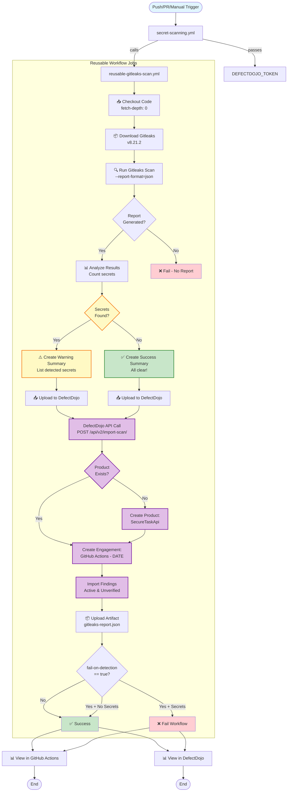
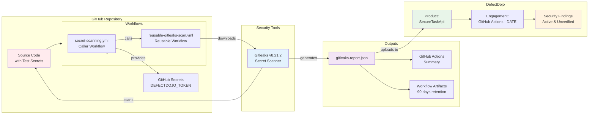
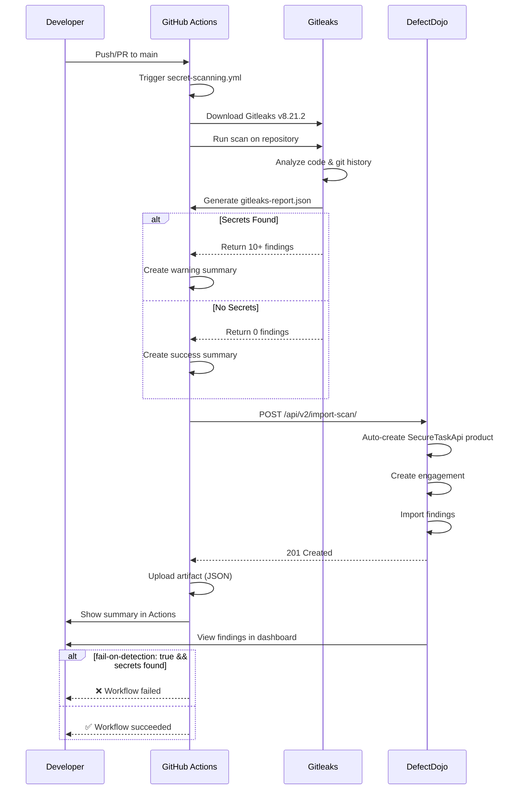
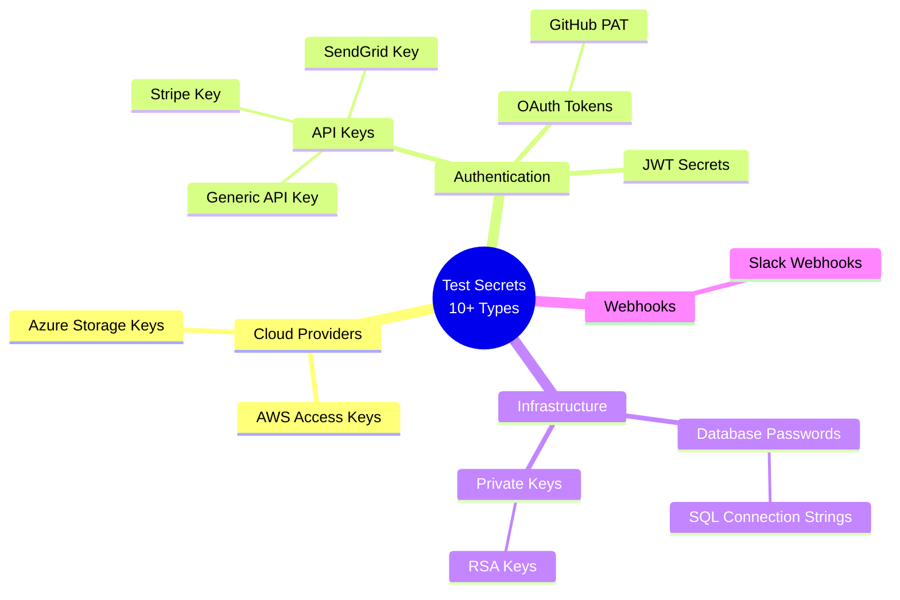

# Gitleaks Workflow Architecture

## Component Diagram



## Data Flow



## Test Secrets Coverage



## DefectDojo Integration Flow

```
┌─────────────────────────────────────────────────────────────┐
│                    GitHub Actions Runner                     │
│                                                              │
│  ┌────────────────────────────────────────────────────┐    │
│  │ 1. Download Gitleaks Binary                        │    │
│  │    wget gitleaks_8.21.2_linux_x64.tar.gz          │    │
│  └────────────────────────────────────────────────────┘    │
│                          ↓                                   │
│  ┌────────────────────────────────────────────────────┐    │
│  │ 2. Run Secret Scan                                 │    │
│  │    ./gitleaks detect --report-format=json         │    │
│  └────────────────────────────────────────────────────┘    │
│                          ↓                                   │
│  ┌────────────────────────────────────────────────────┐    │
│  │ 3. Analyze gitleaks-report.json                   │    │
│  │    - Count: 10-15 secrets expected                │    │
│  │    - Types: AWS, DB, API keys, etc.              │    │
│  └────────────────────────────────────────────────────┘    │
│                          ↓                                   │
│  ┌────────────────────────────────────────────────────┐    │
│  │ 4. Upload to DefectDojo                           │    │
│  │    POST /api/v2/import-scan/                      │    │
│  │    - file: gitleaks-report.json                   │    │
│  │    - scan_type: "Gitleaks Scan"                   │    │
│  │    - product_name: "SecureTaskApi"                │    │
│  │    - auto_create_context: true                    │    │
│  └────────────────────────────────────────────────────┘    │
│                          ↓                                   │
│  ┌────────────────────────────────────────────────────┐    │
│  │ 5. Upload Artifact                                │    │
│  │    Retention: 90 days                             │    │
│  └────────────────────────────────────────────────────┘    │
└─────────────────────────────────────────────────────────────┘
                          ↓
┌─────────────────────────────────────────────────────────────┐
│                      DefectDojo Server                       │
│                  https://demo.defectdojo.org                │
│                                                              │
│  ┌────────────────────────────────────────────────────┐    │
│  │ Product: SecureTaskApi                            │    │
│  │   └─ Engagement: GitHub Actions - 2024-01-15     │    │
│  │       └─ Findings (10-15):                        │    │
│  │           • AWS Access Key (High)                 │    │
│  │           • Database Password (High)              │    │
│  │           • API Keys (Medium)                     │    │
│  │           • JWT Secret (Medium)                   │    │
│  │           • Private Key (High)                    │    │
│  │           • ... and more                          │    │
│  └────────────────────────────────────────────────────┘    │
│                                                              │
│  Status: All findings marked as:                            │
│    - Active: ✅ Yes                                         │
│    - Verified: ❌ No (requires review)                      │
│    - Severity: Info/Low/Medium/High/Critical                │
└─────────────────────────────────────────────────────────────┘
```

## Air-Gapped Adaptation

### Current Implementation (Testing)
```yaml
- name: Download Gitleaks
  run: |
    wget https://github.com/gitleaks/gitleaks/releases/download/v8.21.2/gitleaks_8.21.2_linux_x64.tar.gz
    tar -xzf gitleaks_8.21.2_linux_x64.tar.gz
    chmod +x gitleaks
```

### Production Air-Gapped Environment
```yaml
- name: Use Pre-installed Gitleaks
  run: |
    # Gitleaks is pre-installed at /usr/local/bin/gitleaks
    gitleaks version
```

**Pre-installation on runners:**
```bash
# One-time setup on each runner
sudo wget https://github.com/gitleaks/gitleaks/releases/download/v8.21.2/gitleaks_8.21.2_linux_x64.tar.gz
sudo tar -xzf gitleaks_8.21.2_linux_x64.tar.gz -C /usr/local/bin/
sudo chmod +x /usr/local/bin/gitleaks
sudo rm gitleaks_8.21.2_linux_x64.tar.gz
```
